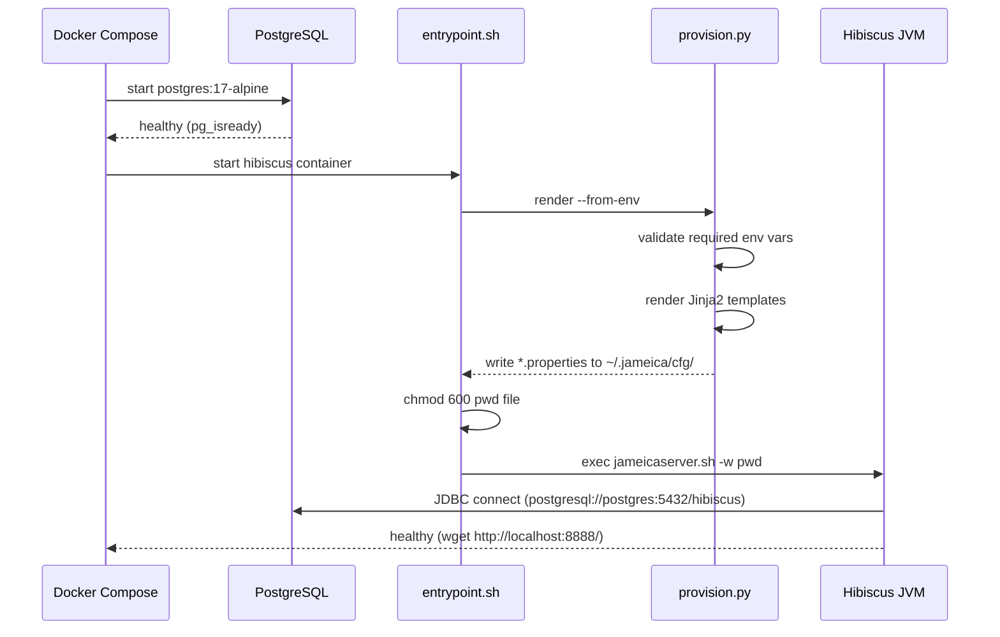
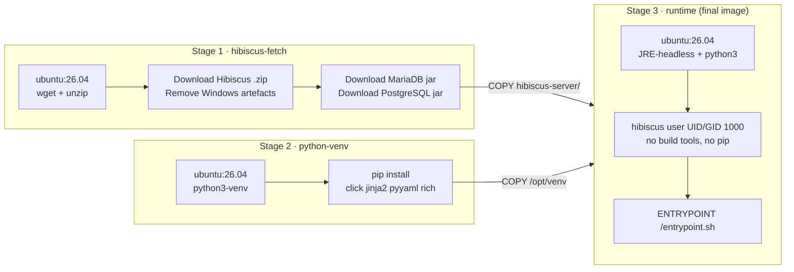
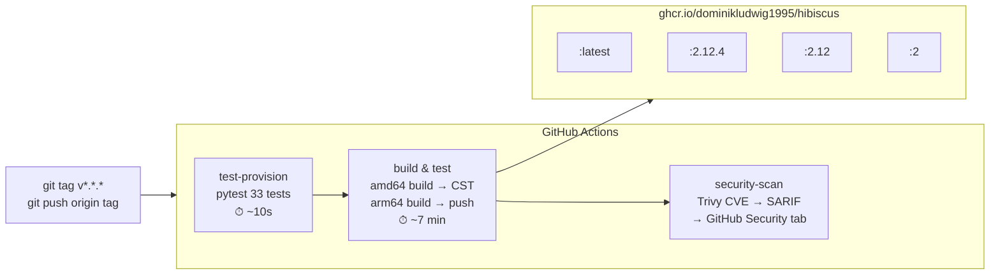

<div align="center">

# 🌺 Hibiscus Docker Server

**Self-hosted HBCI/FinTS online banking — containerized, hardened, ready to ship.**

[](https://github.com/DominikLudwig1995/Hibiscus-Docker-Server/actions/workflows/docker-image.yml)
[](https://github.com/DominikLudwig1995/Hibiscus-Docker-Server/pkgs/container/hibiscus)
[](https://www.willuhn.de/products/hibiscus-server/)
[](https://hub.docker.com/_/ubuntu)
[](#building-locally)
[](LICENSE)

[Quick Start](#quick-start) · [How It Works](#how-it-works) · [Configuration](#configuration) · [Provisioning CLI](#provisioning-cli) · [Upgrading](#upgrading) · [Troubleshooting](#troubleshooting) · [Credits](#credits)

</div>

---

## What is this?

[Hibiscus Server](https://www.willuhn.de/products/hibiscus-server/) is an open-source HBCI/FinTS banking server that gives you programmatic access to your German bank accounts — fetch transactions, check balances, initiate transfers — without relying on any third-party service. You own the server, you own the data.

This repo packages it as a production-ready Docker image:

| | |
|---|---|
| 🔒 **Zero secrets in the image** | All config is provisioned at container startup from environment variables |
| 🐘 **PostgreSQL included** | `docker compose up` brings up the full stack in one command |
| 🏗️ **3-stage build** | Build tools never reach the runtime image — minimal attack surface |
| 🌍 **Multi-arch** | Native `linux/amd64` and `linux/arm64` (Raspberry Pi, Apple Silicon, cloud) |
| 🧩 **Jinja2 provisioner** | Typed, validated config rendering with a Rich CLI |
| 🛡️ **Hardened** | Non-root user, `no-new-privileges`, `cap_drop: ALL`, log rotation |
| 🔍 **Trivy CVE scanning** | Every release scanned, results in GitHub Security tab |
| 🤖 **Dependabot** | Weekly PRs for base image, Actions, and Python dependency updates |

---

## Quick Start

**Prerequisites:** Docker + Docker Compose v2, a German bank account with HBCI/FinTS (PIN/TAN) support.

```bash
# 1. Clone
git clone https://github.com/DominikLudwig1995/Hibiscus-Docker-Server.git
cd Hibiscus-Docker-Server

# 2. Configure
cp .env.example .env
# Edit .env — set HIBISCUS_PASSWORD and DB_PASSWORD

# 3. Start (PostgreSQL → Hibiscus, in order)
docker compose up -d

# 4. Open http://localhost:8888
# Log in with your HIBISCUS_PASSWORD
```

That's it. First startup takes ~90 seconds (JVM + DB initialisation).

> **What just happened?** The provisioner read your `.env`, rendered three `.properties` files into the Jameica config directory, then handed off to the Hibiscus JVM. PostgreSQL was ready first (health-checked before Hibiscus starts).

---

## How It Works

### Startup flow



### Docker image — 3-stage build



### CI/CD pipeline



---

## Configuration

All config lives in `.env`. Copy `.env.example` → `.env` and fill in the required values.

### Required

| Variable | Description |
|----------|-------------|
| `HIBISCUS_PASSWORD` | Master password that unlocks the Hibiscus keystore. **Store this safely — losing it means losing access to your data.** |
| `DB_PASSWORD` | PostgreSQL password, shared between `postgres` and `hibiscus` services |
| `DB_USERNAME` | PostgreSQL username (default: `hibiscus`) |

### Optional

| Variable | Default | Description |
|----------|---------|-------------|
| `DB_NAME` | `hibiscus` | PostgreSQL database name |
| `HIBISCUS_PORT` | `8888` | Host port for the web interface |
| `HIBISCUS_HTTP_AUTH` | `true` | HTTP basic auth on the web interface |
| `HIBISCUS_HTTP_SSL` | `true` | SSL on the web interface |
| `JAMEICA_DATA_PATH` | `./data/jameica` | Host path for persistent Jameica data (keys, history, lock file) |
| `HIBISCUS_IMAGE` | `ghcr.io/dominikludwig1995/hibiscus:2.12.4` | Override to use a locally built image |

### Build args (only needed for `docker compose build`)

| Variable | Default | Description |
|----------|---------|-------------|
| `HIBISCUS_VERSION` | `2.12.4` | Hibiscus version to download |
| `MARIADB_CONNECTOR_VERSION` | `3.5.3` | MariaDB JDBC connector version |
| `POSTGRES_DRIVER_VERSION` | `42.7.7` | PostgreSQL JDBC driver version |

### Advanced Hibiscus env vars (set automatically by compose, override if needed)

| Variable | Default | Description |
|----------|---------|-------------|
| `HIBISCUS_DB_TYPE` | `postgresql` | `postgresql` or `mysql` |
| `HIBISCUS_DB_HOST` | `postgres` | Database hostname |
| `HIBISCUS_DB_PORT` | `5432` | Database port |
| `HIBISCUS_ACCOUNTS_FILE` | — | Path to a YAML file with PIN/TAN bank account entries |

---

## Provisioning CLI

At container startup, `provision.py` reads environment variables and renders three Jinja2 templates into the Jameica config directory (`~/.jameica/cfg/`). You can also run it locally.

### Templates rendered at startup

| Template | Jameica config file | Controls |
|----------|---------------------|---------|
| `HBCIDBService.properties.j2` | `de.willuhn.jameica.hbci.rmi.HBCIDBService.properties` | DB driver, JDBC URL, credentials |
| `Plugin.properties.j2` | `de.willuhn.jameica.webadmin.Plugin.properties` | Web interface port, auth, SSL |
| `PinTanConfig.properties.j2` | `de.willuhn.jameica.hbci.passports.pintan.rmi.PinTanConfig.properties` | PIN/TAN bank account entries |

### Local usage

```bash
cd provision
pip install -r requirements.txt

# Validate before deploying — catches missing required fields early
HIBISCUS_PASSWORD=secret HIBISCUS_DB_USERNAME=hibiscus HIBISCUS_DB_PASSWORD=pass \
  python provision.py validate --from-env

# Preview rendered output (nothing written to disk)
HIBISCUS_PASSWORD=secret HIBISCUS_DB_USERNAME=hibiscus HIBISCUS_DB_PASSWORD=pass \
  python provision.py render --from-env --dry-run

# Write to a local directory
python provision.py render --config provision/config.example.yml --out ./out

# Show resolved config (secrets masked)
python provision.py show --config provision/config.example.yml
```

### Adding bank accounts

Create `accounts.yml` and mount it into the container:

```yaml
# accounts.yml
- name: mybank
  server: hbci.mybank.de
  blz: "12345678"
  userid: myuserid
  customerid: myuserid   # optional — defaults to userid
  hbciversion: "300"     # optional
  port: 443              # optional — default 443
```

```yaml
# docker-compose.yml override
services:
  hibiscus:
    environment:
      HIBISCUS_ACCOUNTS_FILE: /run/accounts.yml
    volumes:
      - ./accounts.yml:/run/accounts.yml:ro
```

---

## Building Locally

```bash
# Build with defaults (uses versions from .env or Dockerfile ARGs)
docker compose build

# Build a specific Hibiscus version
HIBISCUS_VERSION=2.12.4 docker compose build

# Use the locally built image
HIBISCUS_IMAGE=ghcr.io/dominikludwig1995/hibiscus:2.12.4 docker compose up -d

# Multi-platform build with Buildx (outside compose)
docker buildx build --platform linux/amd64,linux/arm64 -t hibiscus:local .
```

---

## Upgrading

### Upgrading Hibiscus

1. Check the [Hibiscus download page](https://www.willuhn.de/products/hibiscus-server/download.php) for the latest version
2. Set `HIBISCUS_VERSION=<new>` in `.env`
3. Rebuild and restart:

```bash
docker compose build --no-cache
docker compose up -d
```

### Upgrading PostgreSQL

```bash
# Stop the stack first
docker compose down

# Pull the new image
docker compose pull postgres

# Restart — Postgres handles minor version upgrades automatically
docker compose up -d
```

> ⚠️ **Major version upgrades** (e.g. 16 → 17) require a data migration. Back up `./data/` first and follow the [PostgreSQL upgrade guide](https://www.postgresql.org/docs/current/upgrading.html).

---

## Backup & Restore

Your data lives in two places:

| What | Where | Contains |
|------|-------|---------|
| Jameica workdir | `JAMEICA_DATA_PATH` (default `./data/jameica`) | Keystore, plugin config, lock file |
| Database | Docker volume `postgres-data` | Transactions, account history |

```bash
# Back up the database
docker exec hibiscus-db pg_dump -U hibiscus hibiscus > hibiscus-$(date +%Y%m%d).sql

# Back up Jameica data
tar czf jameica-$(date +%Y%m%d).tar.gz ./data/jameica

# Restore database
docker exec -i hibiscus-db psql -U hibiscus hibiscus < hibiscus-20250101.sql

# Restore Jameica data
tar xzf jameica-20250101.tar.gz
```

---

## Testing

### Unit tests (33 tests)

```bash
pip install -r provision/requirements.txt pytest
pytest tests/test_provision.py -v
```

Covers: config loading from file and env, `_FILE` secret convention, all three Jinja2 templates, validation, and the full CLI (`render` / `validate` / `show`).

### Container structure tests

```bash
docker build -t hibiscus:test .
container-structure-test test --image hibiscus:test --config tests/container-structure-test.yml
```

Checks: Java + Python available, provisioner importable, all templates present, port 8888 exposed, no Windows artefacts, `update.check=false`.

Both suites run automatically in CI — provisioning tests gate the Docker build.

---

## Troubleshooting

### Container exits immediately

```bash
docker logs hibiscus
```

The provisioner prints exactly which required env vars are missing before exiting. Check that `HIBISCUS_PASSWORD`, `DB_PASSWORD`, and `DB_USERNAME` are set in `.env`.

### Web interface unreachable after startup

```bash
docker compose ps          # hibiscus should show "healthy"
docker logs hibiscus       # look for "started webserver at port 8888" near the end
```

The JVM takes up to 90 seconds to start. The health check `start_period` is 90s — wait before investigating.

### Database connection refused

```bash
docker logs hibiscus | grep -i "jdbc\|connect\|driver"
```

The JDBC URL should contain `postgresql://postgres:5432/`. If it shows `mariadb://localhost:3306/`, the Jameica workdir contains stale config from a previous run. Fix:

```bash
docker compose down
rm -rf ./data/jameica     # removes stale Jameica config
docker compose up -d
```

### Port already in use

```bash
echo "HIBISCUS_PORT=8889" >> .env
docker compose up -d
```

### Full reset (start from scratch)

```bash
docker compose down -v    # removes containers + postgres-data volume
rm -rf ./data/            # removes Jameica workdir
docker compose up -d      # fresh start
```

---

## Security

- **No secrets in the image** — all sensitive values injected at runtime via env vars
- **Non-root container** — runs as `hibiscus` (UID 1000)
- **Password file** — written with `chmod 600`, stored outside the webadmin-served directory
- **`no-new-privileges:true`** — prevents privilege escalation via setuid/setgid bits
- **`cap_drop: ALL`** — all Linux capabilities dropped; Postgres gets back only what it needs
- **Log rotation** — json-file driver, max 10 MB / 3 files per service
- **Trivy CVE scanning** — every release; results in the [Security tab](https://github.com/DominikLudwig1995/Hibiscus-Docker-Server/security/code-scanning)
- **Dependabot** — weekly PRs for Ubuntu base image, GitHub Actions, Python deps
- **Update checks disabled** — `update.check=false` in `UpdateService.properties`; updates handled by rebuilding the image

---

## Credits

This project stands on the shoulders of the Hibiscus and Jameica maintainers.

- **Hibiscus Server** — [willuhn.de/products/hibiscus-server](https://www.willuhn.de/products/hibiscus-server/)
- **Hibiscus source code** — [github.com/willuhn-open-projects/hibiscus](https://github.com/willuhn-open-projects/hibiscus)
- **Jameica** (the plugin runtime) — [willuhn.de/products/jameica](https://www.willuhn.de/products/jameica/)

Thank you for building and maintaining open-source banking software that puts users in control of their own financial data.

---

<div align="center">

Built with ❤️ for the self-hosting community · [Hibiscus Server](https://www.willuhn.de/products/hibiscus-server/) by [willuhn.de](https://www.willuhn.de)

</div>
